### 1. Настройка **gitlab-runner**

1. Поднимаем виртуальную машину, внутри 
устанавливаем gitlab-runner:
curl -L "https://packages.gitlab.com/install/repositories/runner/gitlab-runner/script.deb.sh" | sudo bash
sudo apt-get install gitlab-runner
sudo gitlab-runner register (регестрируемся)
Executor=shell Token=Rnzyx-yj8auUKN1zYSV1 URL=https://git.21-school.ru
sudo gitlab-runner status(проверрка статуса)
sudo gitlab-runner start

### 2. Сборка

Для настройки CI/CD в Gitlab используется файл .gitlab-ci.yml
Создаем файл .gitlab-ci.yml
Пишем этап для **CI** по сборке приложений из проекта *SimpleBashUtils*(проект находится в директории src_simplebash).
(этап запуска сборки через мейк файл из проекта _SimpleBashUtils_)
Артефакты, сохраняются в произвольную директорию со сроком хранения 30 дней

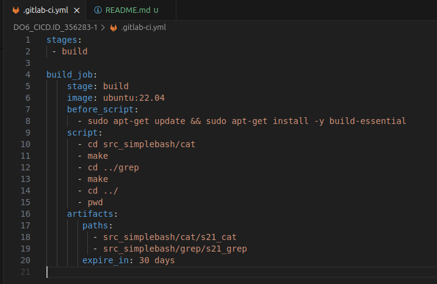

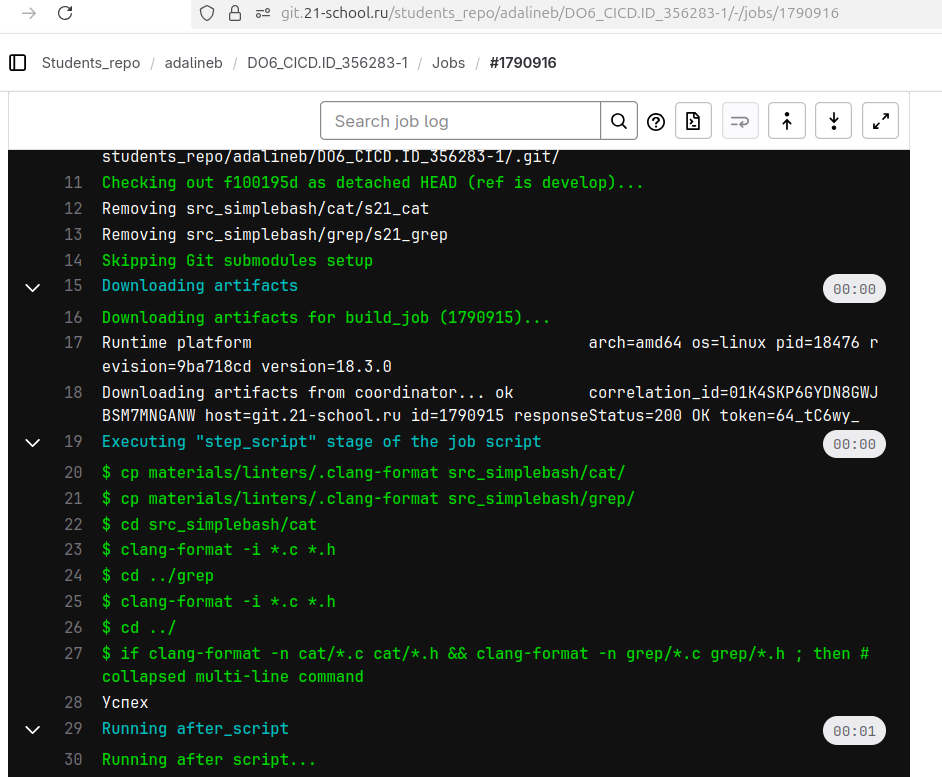

### 3. Тест кодстайла

Написан этап для **CI**, который запускает скрипт кодстайла (*clang-format*).

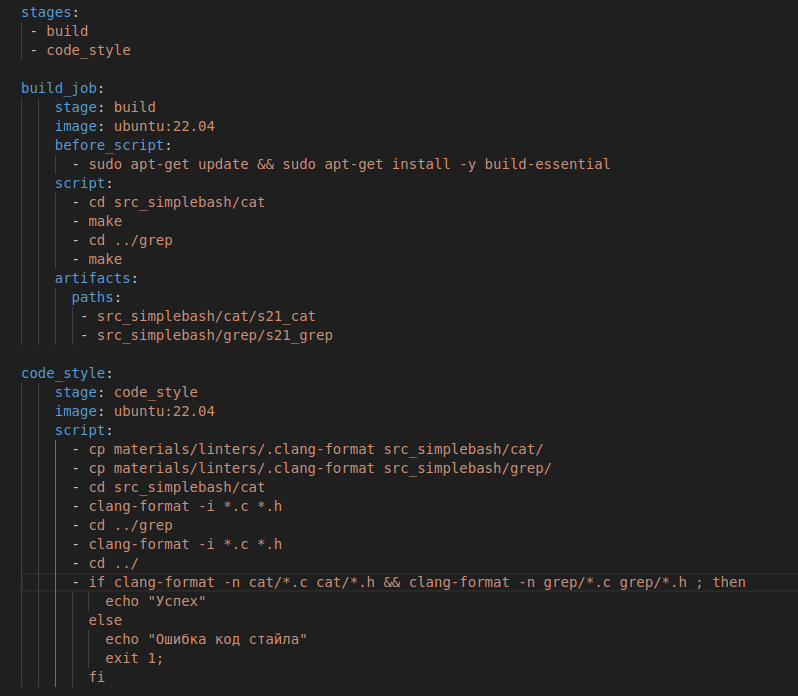

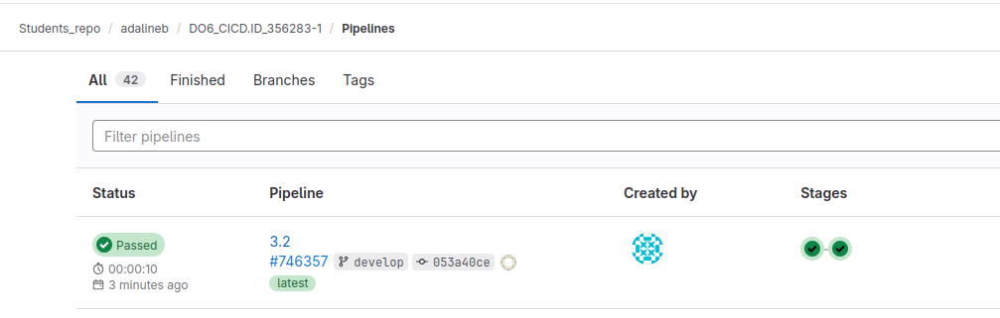

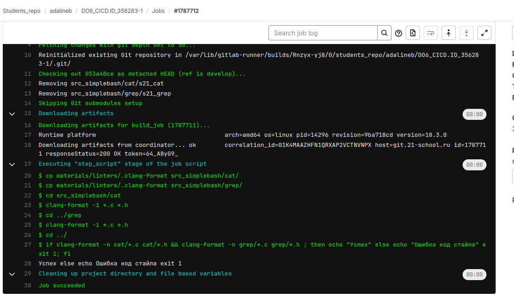

### 4. Интеграционные тесты

Написан этап для **CI**, который запустит интеграционные тесты.
Запуск выполняется автоматически только при условии, если сборка и тест кодстайла прошли успешно.
Если тесты не прошли, то пайплайн 'фейлится".
Вывод тесты успешно прошли.

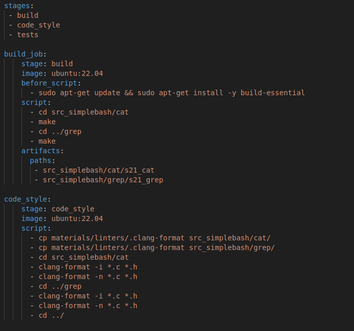

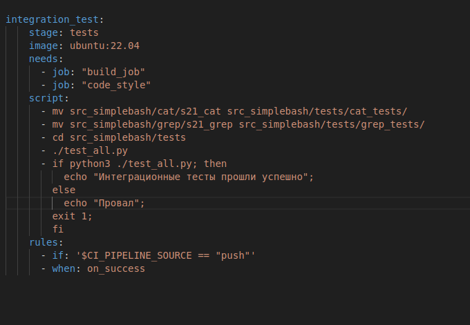

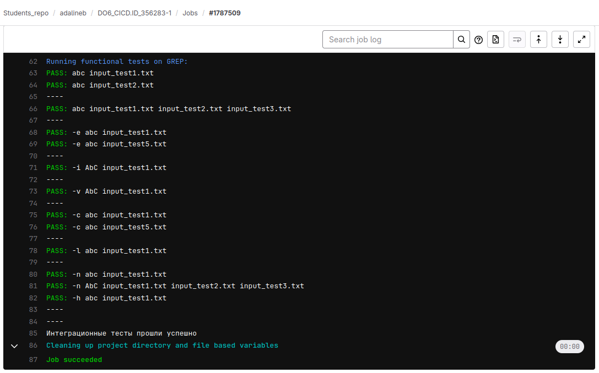

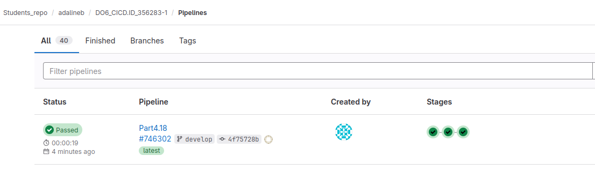

### 5. Этап деплоя

Напиши этап для **CD**, который «разворачивает» проект на другой виртуальной машине.

Поднимаем вторую виртуальную машину(имя машины ws2).
Связываем их с первой виртуальной машинойЖ
В файле /etc/netplan/00-installer-config.yaml указываем адрес:
Для первой машины addresses [192.168.0.2]
Для второй машины addresses [192.168.0.1]
связываем их через routes 

На первой виртуальной машине необходимо сгенерировать ssh-ключ, чтобы в дальнейшем его передать на другую машину. Для генерации используется команда ssh-keygen от имени Gitlab runner'а.
sudo -u gitlab-runner -s
ssh-keygen
ssh-copy-id adalineb@192.168.0.2

Написан bash-скрипт, который при помощи **ssh** и **scp** копирует файлы, полученные после сборки (артефакты), в директорию */usr/local/bin* второй виртуальной машины.

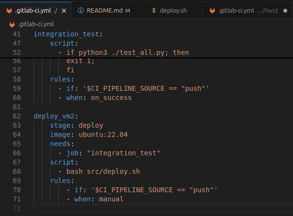

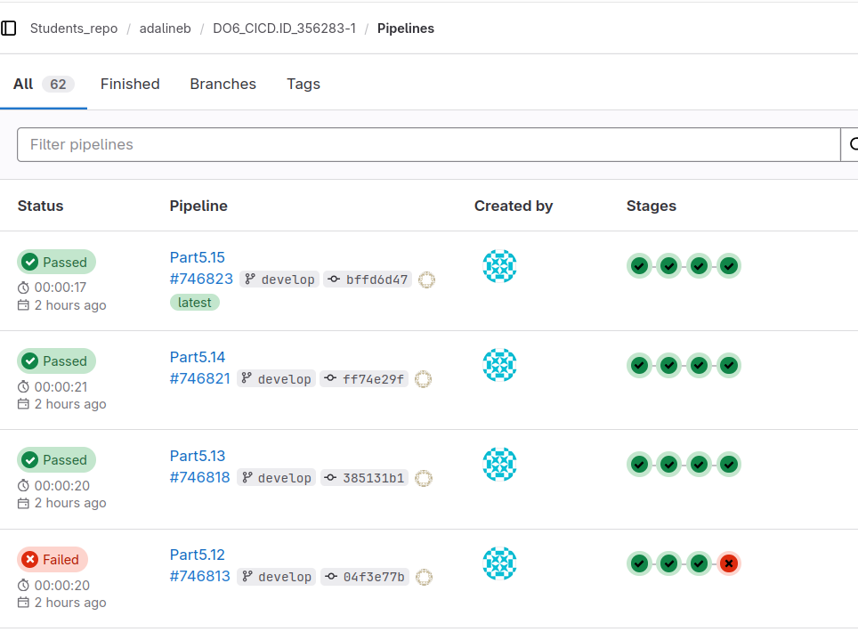

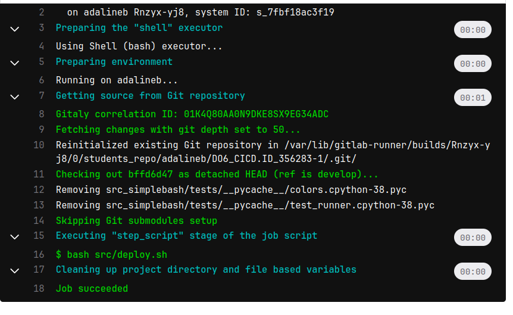

### 6. Дополнительно. Уведомления

Настройка уведомления об успешном/неуспешном выполнении пайплайна через бота с именем «do6_cicd_bot» в *Telegram*.

- Текст уведомления должен содержит информацию об успешности прохождения как этапа **CI**, так и этапа **CD**.

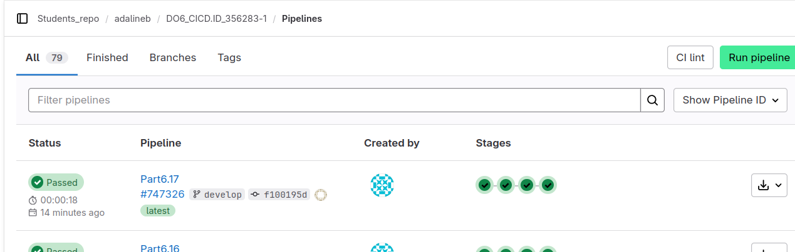

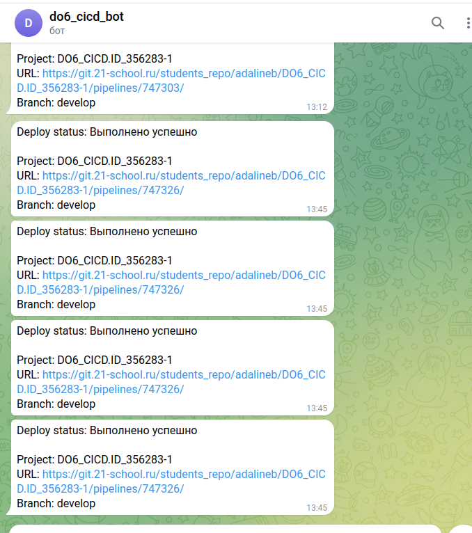